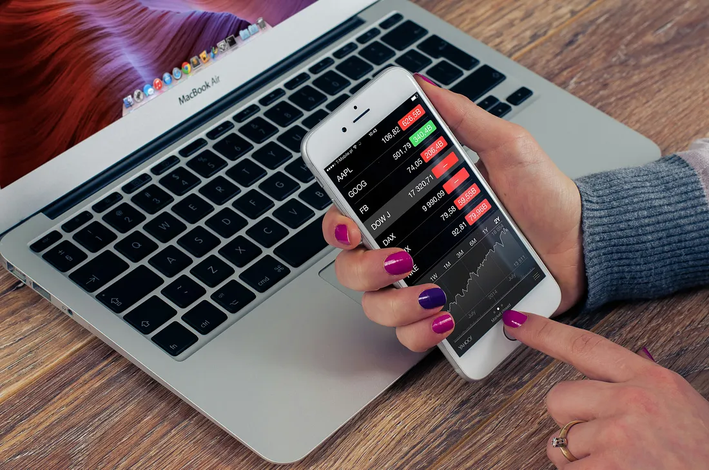

# My Mother Thought Investing Wasn’t Her Domain. I Disagree.

### 
My mother, who is seventy now, worked in a bank for thirty years. She earned her own money, saved some in fixed deposits and bought gold for future security. She is educated, knows how to handle money, can do negotiations at the time of big purchases, managed household expenses all her life. Yet when it came to investing, it was my father who made the decisions. My mother thought she could not do it herself.

I can understand why she felt that way. In her time, information was not readily available. Financial knowledge was not a click away. But now we have mobile apps helping us invest in minutes and endless information at our fingertips.

“I find it scary. A cousin back home lost a lot of money. I do not want that. It feels like gambling.” A friend said to me once. I see the same hesitation in her too.

She is not alone. Millions of women in India who earn good incomes still don’t invest on their own. I see the same effortless management of expenses and the same style of savings as my mother. They know that inflation erodes their purchasing power. They know they need to invest in mutual funds or stocks. Yet, they cannot take a step forward. They also have given the reins to someone else, most of the time to a male member of the family.

In our households for generations, husbands, fathers and brothers managed finances. Women were never encouraged to learn that. In some instances, we were told not to get interested even. Who in my generation heard saying “learn to invest”? We all heard learn to save, buy gold, spend wisely. We were not taught to build wealth ourselves.

As a kid, I competed with my brother in almost everything. If he learned something, I wanted to learn it too. If he was allowed to do something, I wanted the same opportunity. Thankfully, my parents never made a distinction between us. We were given the same education, the same encouragement and expected the same from us. This equality at home turned into confidence for life.

So, when I grew up, I never questioned if I could invest. If my brother could learn about money and make investment decisions, why couldn’t I? It never occurred to me that investing belongs to one gender more than the other.

This I see as the biggest difference between my mother’s generation and mine. She thought it wasn’t her domain; I don’t see a reason why it shouldn’t be mine.

Saving and investing are different skills, but investing is not something that cannot be learnt. It just takes a small investment of time. Many want confidence before investing, but just like driving, this is one field where you learn by doing. You don’t wait to feel brave before getting behind the wheel; you don’t need to be a mechanic to drive a car. Similarly, you don’t need a finance degree or wait till the confidence comes to invest. Confidence is not the prerequisite; it comes as you invest.

The first time I invested, I kept checking the app multiple times a day. When its value came down, I was worried if I had made a mistake. After a few days, it went up. It has happened many times since; each time I learnt that I need to be comfortable with the uncertainty.

As for risk is concerned, we all have different thresholds. Understanding how much risk we can take is an important factor. To begin with, start with a small amount you will not miss. Five hundred bucks that can buy you a cup of coffee is enough to start learning. Even this small amount can generate a significant amount in ten years. The idea is to invest for a long time, not get impatient.

Investing is empowering. When we start investing ourselves, it gives a different kind of confidence. Financial security is another form of caring for yourself.

Imagine my mother had believed that she could invest too. How would she be? Certainly, more confident, more secure. But that generation’s story is already written, cannot be helped. Perhaps mine and the next ones can write a different one.

Writing that different story means getting behind the wheel, not asking someone else to drive you around.

No one is an expert without trying. Ten years down the line, you will forget the fear and congratulate yourself for clicking “invest”. Download a reliable app, complete your KYC, set up a monthly SIP of five hundred and see the change you feel.