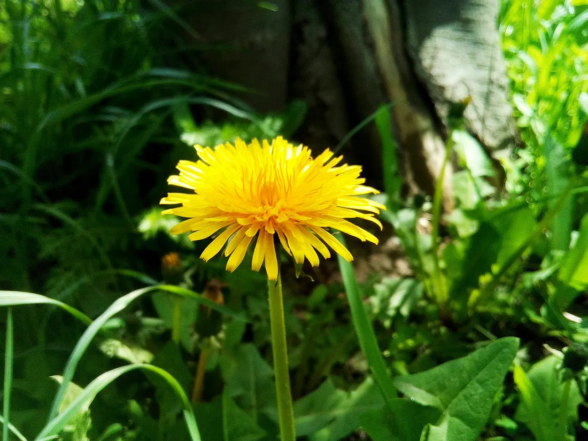

# I Met an Orchid, and It Made Me Question Myself

### 
Every few years, my life seems to reset. I have lived in three countries, moved cities and houses many times, but never felt I didn’t belong. Not only places, but I have also changed careers too, each one vastly different from the one before.

I started as a teacher at an early age, then had a brief stint in banking before moving to Australia from Nepal. Did various odd jobs while in college.

I became a teacher again for a couple of years, then worked in the IT industry, only to give it up to become an actuary. Now I want to pursue writing.

Every time I change place or career, there is excitement. Each time I feel this is my calling. Only to realize a few years down the line that something else is calling me even more. Challenges excite me. That does not mean I love uncertainty, but I don’t fear it either.

When I read about dandelion personality, I knew that was me.

Dr Thomas Boyce and Dr Bruce Ellis first came up with the classification, which was first published in Dr Boyce’s book “The Orchid and the Dandelion”.
The classification was done according to the way an individual will respond to his environment based on his sensitivity.
A highly sensitive one is an orchid, strongly affected by the surroundings, need perfect conditions to blossom.

A dandelion, on the other hand, can find his way in any condition, just like the flower which can sprout from a crack in a rock.
And in between is a tulip, who is moderately sensitive, will not grow in cracks but doesn’t always need the right conditions. He can adapt in different situations and can perform reasonably well.

Being a dandelion has served me well, but it comes with its own problems. I sometimes wonder if I have not stayed long enough to give myself a chance to grow deep roots. What if I had not moved to so many places, not changed so many professions? I know I can survive anywhere, but survival is not the same as flourishing.

In my own household, we are of three different kinds. My husband is no doubt an orchid, and my son is definitely a tulip.

I have seen my husband become a totally different person given the circumstances.
He can be a genius in one group; in another, he will simply retreat.
Every word that is spoken to him reflects on him.
Criticism and encouragement both linger for days.
The atmosphere at home and around him affects him more than me.
It is as if he is a sponge that absorbs the emotions around him.

During his walks in the park, he observes the gardeners, cleaners, and security guards.
He finds them gloomy, and his mood changes. A nearby child laughs, and I see him happy.
His deeply empathetic heart sometimes makes me worry.
He cannot help everyone, he knows, yet he cannot let go.
Anything and everything has a place in his mind.
He cannot not observe and feel.

Watching two of us side by side, one orchid and the other dandelion, one can see the contrasts in us. When we change house, though he may be the first one to talk to the neighbours, I am the one who adapts early. Loud noises, bright lights make him uncomfortable; I can dance through them. Even the fabric of his clothes has to be of a certain type; my wardrobe ranges from silk to synthetic, from rough to smooth.

We can walk along the same path, each carrying a different world. I notice the weather; he notices the loneliness in people. If the place is right, people around happy, he feels comfortable, then he exhibits intense joy; he shines the way I never could. I can grow in crevices; he can only grow in fertile soil, but once grown, people admire the blooms, not the dandelion.

Watching him over the years, I think differently about resilience now. Being able to adapt quickly is always an advantage, but finding the right environment and a place where you are free to bloom can give rise to the extraordinary.

And there is our son, who must be a tulip. He is not hypersensitive but sensitive enough to take some time to adapt. He is not the kind to complain too much, nor someone who is excited by the changes. He doesn’t linger on things for a long time. A school change, a city change makes him uncomfortable for a few days, but he settles easily. He does not need perfect conditions, but he does need some time to get used to things. He makes friends easily, is optimistic and upbeat. He has the sensibility of his father, and I would like to believe, wit from his mother. Looking at him, I realise most people are like him, a tulip, falling somewhere in between an orchid and a dandelion.

For most of my life, I have worn my dandelion nature as pride. I thought it was my strength to make myself at home wherever life takes me. But I am questioning that certainty now. Would I have flourished differently if I were wired differently? Or is my ability to start over again and again a different kind of gift?

I don’t know. Maybe I will always be a dandelion, and that is what I am supposed to be. Maybe the purpose of life is to be the fullest version of myself, not wishing to be someone I am not. Orchid does not apologise for needing care, dandelion does not envy an orchid’s bloom, and a tulip doesn’t wish to grow through cracks. They become what they were meant to be. Perhaps I shouldn’t either.