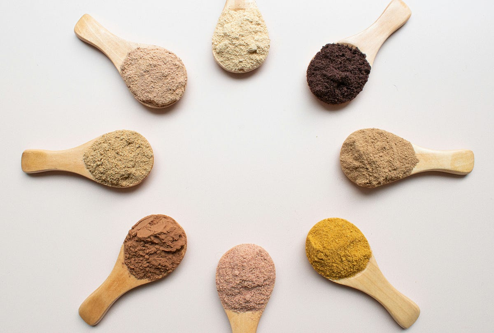

# Am I Drinking the Hype?

### 
Every day after gym, I rush home to get my post-workout treat. I whirl a scoop of protein powder in cold milk with added coffee and a pinch of creatine. Then I sit by my terrace window and sip this smooth, ice-cold concoction in absolute peace. My brain then gets the signal that my fitness goal for the day is officially met.   

Yet, all the while, a small voice asks me in my head, “Do I really need this? Or am I just drinking the hype?”

### The debate I want to resolve
Lately, I've noticed that every conversation eventually turns to the gym, and someone always asks, “Do you take protein powder?” We are all experts, and we all are loud in our opinions.

Should we take it?

How often?	

Which type?

Will it turn us into chiselled gym bodies, or will our kidneys take the hit?

Those who oppose bring doctors into the conversation, and those who support also have doctors on their sides.  YouTube doesn’t help either, with millions claiming it is the elixir of life, and other millions warning it as a toxic scam. 

I have been drinking it for one year now on my weight-training days, but that does not make me an expert. That’s why I keep on asking everyone I meet, hoping someone there has an answer. 

### Mission to find a perfect one

The debate doesn’t stop at whether we should drink it; it extends to which kind. In my quest to find the perfect one, I have tried whey, plant and recently fermented yeast.

**The Plant:** To those who support plant-based, I am sorry to say this one I found the worst in taste. Every plant protein I have tried tasted like pulverised chalk. If you don’t drink it in under a minute, it will turn into a thick, curry-like texture that instantly kills your faith in protein. The dusty taste is compensated with flavours so intense they feel like a biohazard. Yet I see celebrities drinking them with smiles, and I fall for them all over again. Also, because they are cheaper, I naively keep buying small packs, hoping for a surprise which is yet to come.

**The whey:** The classic. It mixes well, mildly flavoured and tolerable in taste; it does not turn into a clay slurry if you take your time to drink. If your stomach can digest it and your wallet can handle paying twice the price of the plant protein every month, it is a solid choice.

**The fermented yeast:** My latest experiment, a new twist in the market, and I am pleasantly surprised. It’s easy on the stomach, tastes decent and doesn’t require budgeting the monthly expense like whey.

Whichever form you take, they all seem to promise the same muscle recovery and building. So, the real battle is not about the biology; it is the negotiation between your wallet, your taste buds, and your belly.     

### What am I afraid of
**Overdoing:** After watching reels after reels of the workout videos of the toned gym experts, I sometimes get tempted to drink it three times a day, each time a different type. If it is that good and necessary, why not?  

Then my overthinking brain doesn’t let me. I worry about the downsides. I imagine myself with a stomach bloated to the size of a football, not being able to pass motion for three days and the misery that follows. 

There is also a concern about my kidneys. Not that they are acting out right now. But what if they start? Why take chances?

**The ingredients:** Finding a brand that is clean and has only those declared ingredients is like winning a jackpot. I read the ingredients before I buy them. But I still wonder if there is something there that is not being written. We have been reading in the news now and then that some brands have been found to contain heavy metals and unnecessary, undeclared stimulants. Knowing that something I take for my health could come with other health risks is not reassuring. 

The biggest deterrent for me, especially, has been the added sugars, apparently the key behind my weight gain and inflammation. 

### Why am I still drinking
**Muscle and Bone health:**  When I take just a scoop after I lift weights, I feel I recover better. I don’t feel the soreness the next day. Whether that is entirely because of protein, I cannot say. I also feel my body is getting toned and defined slowly over the months. At this age, when my joints have started making those weird clicking sounds, I want to keep my bones and connective tissues also healthy. 

**Satiety:** Drinking it has kept me full for a long time. I am not opening the refrigerator too often these days. I am able to control the hunger pangs in between meals, and the late-night snacking has completely vanished. 

**Convenience:** Planning meals around enough protein in each meal in an Indian household is a challenge. We are primarily carb eaters. How much protein can rice and roti with dal and sabji give me, after all?   And eating 60 grams of protein from non-veg day after day is not realistic in my kitchen. 

Even with meat and eggs, it is a convenient option for that extra need. 

### So, what shall I do

I know I can get all the protein I need from real, whole food. But it is way easier to get the same amount from the scoop. 

For now, I will keep sipping the cold brew. It doesn’t solve the debate, but it tastes good, helps me recover and gives me a few quiet minutes to contemplate before I go for the next round.
