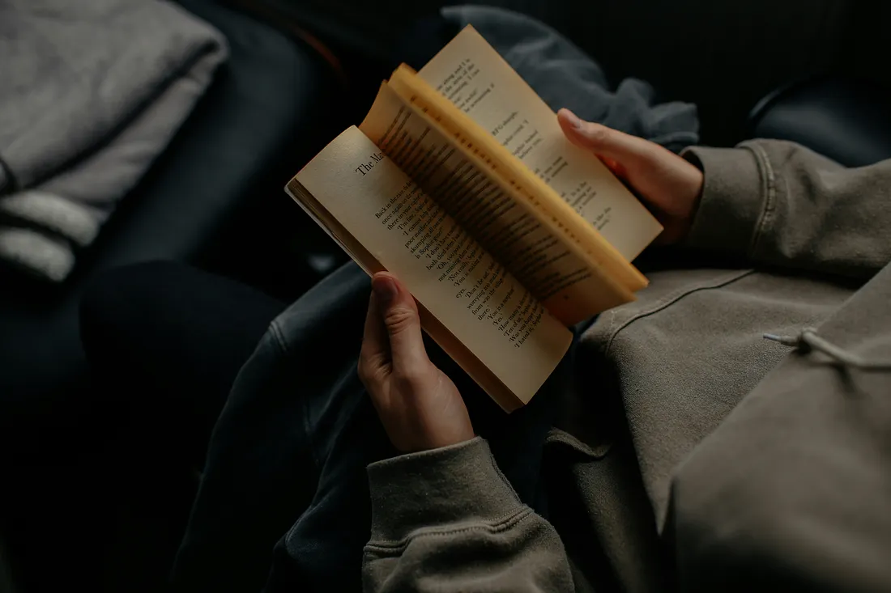

# Why Insomniacs Must Read at Night

### 
As someone who has spent sleepless nights, I know the frustration of counting down from 1000, playing word chain in my mind, and getting anxious about waking up in time the next morning. When my mind refuses to switch off at 1 am and my hands itch to grab the phone one last time, I know I am screwed for the night. I am well aware of the way neurons light up and run amok, refusing to shut down.

Countless others have gone through the same. Insomnia is very common. My friends who are of similar age and gender are all drinking chamomile tea and popping magnesium to help sleep. I do too, without fail, each night before bedtime. But there is one more thing I have brought back from my childhood habit to calm my mind: reading.

Since the time I made a ritual of shutting my gadgets one hour before bedtime and reading for an hour or so, my nights have been restful. This habit has saved me from endless scrolling and given me an exit from the chaos of the daytime.

A friend asked me last week when we were spending a night together, and I took out a copy of Anxious People by Fredrik Backman and started reading while four of them were having a good time checking and sharing their Insta and fb feeds: “Why is it that you are so interested in books always? What are you getting that I am missing?”

“A good night’s sleep”, I said.

For my overstimulated, sleep-deprived brain, reading has been the most effective way to wind down. It has shifted me from the anxiety of “oh, I won’t be able to sleep again tonight!” mode to “let me read a few pages” mode.

I tried listening to music, which was nice, but it was not as effective. I would still want to listen to one more song before I call it a day, one becoming many and an hour gone just like that. Then I switched to podcasts. The ones that I was interested in kept me hooked, and the ones that I didn’t enjoy so much could not hold me enough. I still listen to some just before sleeping, but after I close my book. The voice gets fuzzy after some time, working like white noise. The reading prepares my brain to get to that state and sleep without fail each night.

The researchers at the University of Sussex did a study in 2009 with a small group of participants, where they found that silent reading can reduce stress by as much as 68%, which is more than other relaxation activities they tested. It slows the heart rate and eases muscular tension. The study also confirmed that it is more effective and faster than listening to music or drinking tea.

It seems our mind is not able to multitask as it reads. Reading takes over the space that would otherwise be taken by verbal processing, making the brain unable to track time or think about other stresses. This limits the cognitive stimulation and helps in slowing down.

When I am looking at the pages from one end to the other, repetitively and in a rhythmic fashion, which is called saccadic movement, my eyes get tired after some time; my eyelids feel heavy, and I want to close them.

Also, because it has a fixed linear pace and there is only one thing to focus on, I get bored and sleepy after some time.

I have switched from reading on my tablet, fearing that it will emit blue light and lower melatonin, to reading print. I have traded the dopamine spikes for a better circadian rhythm. I still read on my tablet sometimes, but I make sure that the eye-protection mode is turned on.

But not all reading may be suitable for bedtime. Some thrillers and mysteries have kept me awake, my brain going into problem-solving mode and trying to figure out who had done it. So, I choose books that are engaging enough to distract me from the disturbances but gentle enough to put down.

Who would have thought the habit that was cultivated in childhood when there was no TV, let alone mobile phones, would come in handy in my middle age?

Perhaps all the insomniacs out there just need a quiet room, a book, and a desire to disappear in a different world.

Sweet dreams.